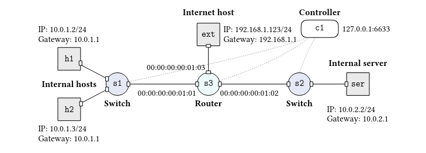

<!-- @format -->

# Lab 1 — Hey Switches and Routers

**Course:** Advanced Networked Systems (SS26)  
**Deadline:** 17.05.2026 23:59  
**Points:** 15

---

## Table of contents

1. [Overview](#overview)
2. [Network topology](#network-topology)
3. [File structure](#file-structure)
4. [Dependencies and setup](#dependencies-and-setup)
5. [Running the project](#running-the-project)
6. [Controller architecture](#controller-architecture)
7. [Switch logic](#switch-logic)
8. [Router logic](#router-logic)
9. [Security policy](#security-policy)
10. [Testing and expected results](#testing-and-expected-results)
11. [Troubleshooting](#troubleshooting)
12. [Key concepts reference](#key-concepts-reference)

---

## Overview

This project implements a software-defined networking (SDN) controller using **Ryu** and **OpenFlow 1.3** to manage an emulated network in **Mininet**. The controller programs three OpenFlow switches: two behave as learning Ethernet switches and one behaves as an IP router.

The controller handles:

- MAC learning and flow-rule installation on switches s1 and s2
- ARP resolution (answering ARP requests for gateway IPs and sending ARP requests for next-hop MAC resolution)
- IP routing with Ethernet header rewriting across three subnets
- Security filtering — blocking ICMP from the external host to internal hosts, and blocking TCP/UDP between the external host and the internal server

---

## Network topology



### Hosts

| Host | IP address       | Gateway     | Subnet         |
| ---- | ---------------- | ----------- | -------------- |
| h1   | 10.0.1.2/24      | 10.0.1.1    | 10.0.1.0/24    |
| h2   | 10.0.1.3/24      | 10.0.1.1    | 10.0.1.0/24    |
| ser  | 10.0.2.2/24      | 10.0.2.1    | 10.0.2.0/24    |
| ext  | 192.168.1.123/24 | 192.168.1.1 | 192.168.1.0/24 |

### Router ports (s3)

| Port | Gateway IP  | Gateway MAC       | Connected to |
| ---- | ----------- | ----------------- | ------------ |
| 1    | 10.0.1.1    | 00:00:00:00:01:01 | s1 (h1, h2)  |
| 2    | 10.0.2.1    | 00:00:00:00:01:02 | s2 (ser)     |
| 3    | 192.168.1.1 | 00:00:00:00:01:03 | ext          |

### Link properties

All links: **bandwidth 15 Mbps**, **delay 10 ms**

---

## File structure

```
lab1/
├── ans_controller.py   # Ryu controller — switch + router logic
├── run_network.py      # Mininet topology definition and launcher
└── README.md
```

### `run_network.py`

Defines the Mininet topology using the `Topo` class. Creates s1, s2, s3, h1, h2, ser, ext with the IP addresses and link properties from the lab spec. Connects to a remote controller at `127.0.0.1:6653`.

### `ans_controller.py`

The Ryu controller application. Contains the `LearningSwitch` class which inherits from `RyuApp` and handles all OpenFlow events. Internally dispatches PacketIn events to either `_switch_handler` (for s1/s2) or `_router_handler` (for s3) based on the datapath ID.

---

## Dependencies and setup

### Required software

- Python 3.10
- Mininet
- Open vSwitch (OVS)
- Ryu SDN framework

### Known version conflicts and fixes

Ryu depends on `eventlet`, which has compatibility issues with recent versions of `dnspython` and Python 3.10+. Apply these fixes before running:

**1. Downgrade dnspython**

```bash
pip install dnspython==2.2.1
```

**2. Downgrade eventlet**

```bash
pip install eventlet==0.33.3
```

**3. Patch Ryu's wsgi.py** (removes a broken import that was removed from eventlet 0.33+)

```bash
sudo sed -i 's/from eventlet.wsgi import ALREADY_HANDLED/ALREADY_HANDLED = b""/' \
  $(python3 -c "import ryu; import os; print(os.path.dirname(ryu.__file__))")/app/wsgi.py
```

---

## Running the project

Always start the controller **before** starting Mininet, otherwise Mininet will print a warning and the switches will have no rules installed.

### Step 1 — terminal 1: start the controller

```bash
cd lab1/
ryu-manager ans_controller.py
```

Wait until you see output like:

```
loading app ans_controller.py
loading app ryu.controller.ofp_handler
instantiating app ans_controller.py of LearningSwitch
instantiating app ryu.controller.ofp_handler of OFPHandler
```

### Step 2 — terminal 2: start the network

```bash
cd lab1/
sudo python3 run_network.py
```

You should see:

```
Connecting to remote controller at 127.0.0.1:6653
```

This confirms the switches connected to the controller successfully.

### Step 3 — run tests in the Mininet CLI

```
mininet> pingall
mininet> h1 ping h2 -c3
mininet> h1 ping 10.0.1.1 -c1
mininet> iperf h1 h2
```

---

## Controller architecture

The controller is a single Ryu application class `LearningSwitch` that manages all three switches simultaneously. It maintains three shared data structures:

```python
self.mac_to_port = {}   # { dpid: { mac: port } } — switch forwarding tables
self.arp_cache   = {}   # { ip: mac }              — router ARP cache
self.pending     = {}   # { dst_ip: [(dp, port, data), ...] } — queued packets
```

On startup, every switch receives a **table-miss rule** (priority 0, match-all, action: send to controller). This ensures any packet with no matching rule is forwarded to the controller for processing. Once the controller learns the forwarding information, it installs higher-priority rules directly on the switch so future packets in the same flow never need to reach the controller.

### Datapath ID (DPID) dispatch

Mininet assigns DPIDs equal to the switch number by default. The controller uses this to route PacketIn events to the correct handler:

```python
if dpid in (1, 2):      # s1 and s2
    self._switch_handler(...)
elif dpid == 3:         # s3
    self._router_handler(...)
```

---

## Switch logic

Handles PacketIn events for s1 (subnet 10.0.1.0/24) and s2 (subnet 10.0.2.0/24).

### MAC learning

Every arriving packet reveals that the sender's MAC address is reachable on the incoming port:

```python
self.mac_to_port[dpid][src_mac] = in_port
```

### Forwarding decision

If the destination MAC is in the forwarding table, use the known port. Otherwise flood (send out every port except the one the packet arrived on):

```python
if dst_mac in self.mac_to_port[dpid]:
    out_port = self.mac_to_port[dpid][dst_mac]
else:
    out_port = OFPP_FLOOD
```

### Flow rule format

When the destination port is known, a flow rule is installed on the switch:

```python
match = OFPMatch(
    in_port=in_port,    # which port the packet came in on
    eth_src=src_mac,    # sender's MAC
    eth_dst=dst_mac,    # destination MAC
)
actions = [OFPActionOutput(out_port)]
self.add_flow(datapath, priority=1, match=match, actions=actions, idle_timeout=60)
```

Matching on the triple `(in_port, eth_src, eth_dst)` rather than just `eth_dst` prevents rule conflicts when the same destination MAC appears across multiple flows from different directions.

Rules expire after **60 seconds of inactivity** (`idle_timeout=60`) to keep the flow table clean.

---

## Router logic

Handles PacketIn events for s3. The router processes both ARP and IP packets.

### ARP handling (`_router_arp`)

When an ARP packet arrives:

1. **Learn** the sender's IP → MAC mapping into `arp_cache`
2. **Flush** any packets queued in `pending` that were waiting for this IP
3. If it is an ARP request for one of the router's own gateway IPs, **reply** with the corresponding virtual MAC

```python
# Build and send ARP reply
reply = Packet()
reply.add_protocol(ethernet(dst=requester_mac, src=own_mac))
reply.add_protocol(arp(opcode=ARP_REPLY, src_mac=own_mac, src_ip=gateway_ip,
                       dst_mac=requester_mac, dst_ip=requester_ip))
self._send_pkt(datapath, in_port, reply)
```

### IP handling (`_router_ip`)

When an IP packet arrives:

1. **Learn** the sender's IP → MAC from the Ethernet source
2. **Check** if the destination is one of the router's own gateway IPs — if so, handle a ping or drop it (cross-subnet gateway pings are not permitted)
3. **Look up** the egress port using the destination IP's /24 prefix
4. **Apply security rules** — drop ICMP from ext to internal hosts, drop TCP/UDP between ext and ser
5. **Forward** by calling `_forward_ip`

### IP forwarding (`_forward_ip`)

1. Look up the destination MAC in `arp_cache`
2. If the MAC is unknown: queue the packet in `pending`, send an ARP request, return
3. If the MAC is known: build a new Ethernet frame with rewritten `eth_src` and `eth_dst`, install a flow rule, send the packet

```python
# Install flow rule for future packets in this flow
match = OFPMatch(eth_type=ETH_TYPE_IP, ipv4_src=src_ip, ipv4_dst=dst_ip)
actions = [
    OFPActionSetField(eth_src=router_egress_mac),
    OFPActionSetField(eth_dst=destination_mac),
    OFPActionOutput(egress_port),
]
self.add_flow(datapath, priority=10, match=match, actions=actions, idle_timeout=60)
```

### Gateway ping (`_icmp_reply`)

When a host pings its own gateway (e.g. `h1 ping 10.0.1.1`), the controller constructs and sends an ICMP echo reply directly:

```python
reply.add_protocol(ipv4(dst=requester_ip, src=gateway_ip, proto=1))
reply.add_protocol(icmp(type_=ICMP_ECHO_REPLY, code=0, data=original_data))
```

Only hosts in the same subnet as the gateway may ping it. Pings to a gateway from a different subnet are silently dropped.

---

## Security policy

All security rules use **priority 20** — higher than the forwarding rules at priority 10 — so they always take effect regardless of any matching forwarding rule.

A rule with an empty actions list means **drop**:

```python
self.add_flow(datapath, priority=20, match=match, actions=[], idle_timeout=300)
```

### Rule 1 — block ICMP from ext to internal hosts

```
Source:      192.168.1.0/24 (ext's subnet)
Destination: 10.0.1.0/24 or 10.0.2.0/24 (any internal subnet)
Protocol:    ICMP (ip_proto=1)
Action:      DROP
```

This prevents the external host from ping-scanning internal hosts to discover whether they exist.

### Rule 2 — block TCP/UDP between ext and ser

```
Source:      192.168.1.0/24, Destination: 10.0.2.0/24, Protocol: TCP or UDP → DROP
Source:      10.0.2.0/24,   Destination: 192.168.1.0/24, Protocol: TCP or UDP → DROP
```

This blocks both inbound connections from ext to ser and outbound connections from ser to ext.

Note: TCP/UDP between ext and h1 or ext and h2 is **not** blocked.

---

## Testing and expected results

### pingall

```
mininet> pingall
*** Ping: testing ping reachability
ext -> X X X
h1  -> X h2 ser
h2  -> X h1 ser
ser -> X h1 h2
*** Results: 50% dropped (6/12 received)
```

### Gateway ping (same subnet — should succeed)

```
mininet> h1 ping 10.0.1.1 -c1
64 bytes from 10.0.1.1: icmp_seq=1 ttl=64 time=~45ms
```

### Gateway ping (different subnet — should fail)

```
mininet> h1 ping 10.0.2.1 -c1
1 packets transmitted, 0 received, 100% packet loss
```

### TCP bandwidth test

```
mininet> iperf h1 h2
*** Results: ['~13 Mbits/sec', '~16 Mbits/sec']
```

### Inspect installed flow rules

```bash
sudo ovs-ofctl dump-flows s1
sudo ovs-ofctl dump-flows s2
sudo ovs-ofctl dump-flows s3
```

---

## Troubleshooting

### "Unable to contact remote controller at 127.0.0.1:6653"

You started Mininet before the controller. Stop Mininet, start the controller first (`ryu-manager ans_controller.py`), then start Mininet.

### `ImportError: cannot import name 'ALREADY_HANDLED'`

Apply the wsgi.py patch described in the [Dependencies and setup](#dependencies-and-setup) section.

### `AttributeError: module 'dns.rdtypes' has no attribute 'tlsabase'`

Run `pip install dnspython==2.2.1` to downgrade dnspython.

### `TypeError: cannot set 'is_timeout' attribute of immutable type 'TimeoutError'`

Run `pip install eventlet==0.33.3` to get a version compatible with Python 3.10.

### First ping shows 100% packet loss

This is expected on the very first `ping` across a new path — the ARP resolution and flow rule installation take longer than the default ping timeout. Run `ping -c3` and the second and third packets will succeed.

### Flow rules not installing on s3 (router)

Check that the router's DPID is 3 in your Mininet setup. Run `sudo ovs-ofctl show s3` and verify the datapath ID.

---

## Key concepts

### Why both IP and MAC addresses?

IP addresses identify where a host is in the network (which subnet). MAC addresses identify the hardware device itself. Within a subnet, Ethernet delivers frames by MAC address. Across subnets, IP routing decides the path. Routers bridge the two layers by rewriting the MAC header at each hop while keeping the IP header unchanged.

### Why does the router rewrite the Ethernet header?

Each Ethernet frame is only valid for one hop (one local network segment). When the router forwards a packet to the next subnet, it must create a new Ethernet frame addressed to the next-hop device. The IP source and destination remain the original sender and final recipient throughout the entire journey.

### What is ARP and why is it needed?

ARP (Address Resolution Protocol) resolves an IP address to a MAC address within a subnet. Before any IP packet can be sent on Ethernet, the sender must know the MAC address of the next hop. ARP broadcasts "who has IP x.x.x.x?" and the owner replies with its MAC.

### What is a flow rule?

A flow rule stored in a switch's flow table tells the switch: "if a packet matches these header fields, perform these actions." Matching can be on any combination of Ethernet, IP, TCP, and UDP fields. Actions include forwarding out a port, rewriting header fields, or dropping. The controller installs flow rules via OpenFlow so that the switch can handle future packets without contacting the controller.

### What is the table-miss rule?

The table-miss rule has match-all (empty match) at priority 0. It is the catch-all that handles any packet with no other matching rule by sending it to the controller. Every switch receives this rule at startup. All specific forwarding rules have higher priority and take precedence over it.
